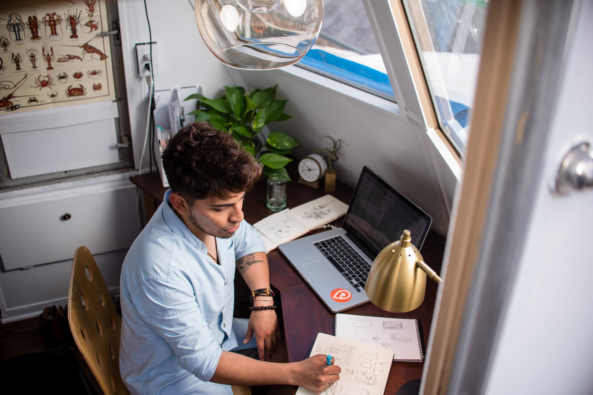

# :woman: Personas :man:

## Inhalt
- [Student](#Student)
- [Freelancer](#Freelancer)
- [Designagentur](#Designagentur)
- [Szenarien](#Szenarien)

---

*Foto: Unsplash*

### Kevin B. - Student

- 22 Jahre alt
- hat kein Geld
- hat ein Macbook (vielleicht nur um anzugeben)
- findet Clouds zwar nützlich aber möchte auf sie verzichten
- arbeitet in kleinen Gruppen an Projekten
- nutzt gerne: Pinterest, Instagram, Unsplash, Adobe CC, Google Fonts und Adobe Fonts

---

*Foto: Unsplash*

### Ben T. - Freelancer

- 29 Jahre alt
- möchte auf Clouds verzichten
- arbeitet meistens alleine, aber hält immer mal wieder Rücksprache mit dem Klienten
- benutzt gerne: Pinterest, FreePics, Unsplash, Evernote, Adobe CC, Google Fonts und Adobe Fonts

---

*Foto: Unsplash*

### Designagentur

- haben eine eigene Cloud / Server
- arbeiten 90% der Zeit zusammen im Team
- nutzen Adobe CC, Unsplash, Google Fonts und Adobe Fonts

---

# Szenarien

- Als `Designagentur` möchten wir `ein Moodboard entwickeln` um `schnellstmöglich den Look und Feel eines Corporate-Designs festzulegen`
- Als eine `Gruppe von 4 Studenten` möchten wir `sich Inspirationsquellen zusammenstellen` um `eine Richtung des Design für ihre App festzulegen`
- Als `Freelancer` möchte ich `ein Moodboard erstellen` um `mir zu einen Leitfaden für das Design eines Flyers zu geben`
